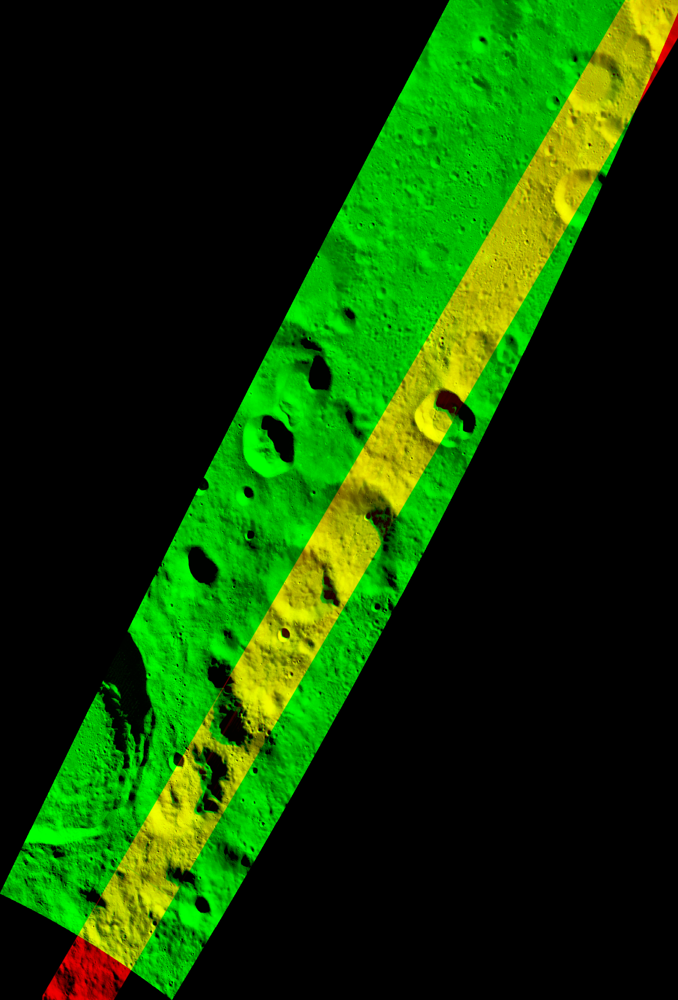
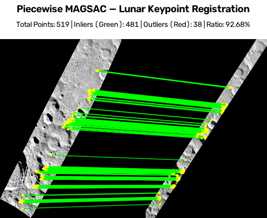

# SelenoMatch: Lunar Cross-Sensor Image Registration 

**A hybrid detector-free + radiation-invariant pipeline for co-registering Chandrayaan-2 and LRO optical imagery in South Polar Stereographic space.**


> Problem Statement ID: `<SIH26166>` · Team: `<SelenoMatch>`

<p align="center">
  
  
</p>

---

## Table of Contents
1. [Overview](#1-overview)
2. [Highlights](#2-highlights)
3. [System Architecture](#3-system-architecture)
4. [Stage-by-Stage Technical Detail](#4-stage-by-stage-technical-detail)
5. [Coordinate Frame Conventions](#5-coordinate-frame-conventions)
6. [Repository Structure](#6-repository-structure)
7. [Installation](#7-installation)
8. [Usage](#8-usage)
9. [Configuration Reference](#9-configuration-reference)
10. [Outputs](#10-outputs)
11. [Evaluation Metrics](#11-evaluation-metrics)
12. [Design Rationale](#12-design-rationale)
13. [System Scope & Technical Constraints](#13-system-scope--technical-constraints)
14. [References](#14-references)
---

## 1. Overview

Lunar polar imagery comes from many instruments with very different radiometry, geometry and resolution: ISRO's Chandrayaan-2 **TMC** and **OHRC** cameras and **IIRS** imaging spectrometer (distributed as unprojected PDS3/XML products), and NASA's **LRO** GeoTIFFs. Registering them against one another is hard because:

- **Non-linear radiometric differences.** Different sensors, spectral bands, and solar geometry produce intensity relationships that classical gradient/SIFT-style descriptors do not survive.
- **Extreme illumination.** At the poles the sun sits at grazing angles, so shadows move drastically between acquisitions and dominate local appearance.
- **Heterogeneous georeferencing.** Some products carry an affine transform, others only four lat/lon corner coordinates.
- **Resolution mismatch** between sensors (m/px) and large scene sizes that do not fit on a GPU in one shot.

This repository implements a **10-stage, fully in-memory pipeline** that takes two raw products, computes their geographic overlap, resamples both onto a shared metric grid, extracts correspondences using **two complementary matchers run in parallel (LoFTR and RIFT-2)**, fuses them with solar-incidence-aware weighting, verifies them geometrically with **MAGSAC** (global and piecewise), refines the inliers to sub-pixel precision, and emits warped rasters, overlays, tie-point files and diagnostics.

---

## 2. Highlights

- **Dual-branch matching.** A learned transformer matcher (LoFTR) and a hand-crafted phase-congruency matcher (RIFT-2) run on the *same* macro-patch, with results expressed in the same coordinate frame.
- **GPU-vectorised phase congruency.** RIFT-2's log-Gabor bank (4 scales × 6 orientations) is re-implemented in PyTorch with FFT-domain filtering (`phasecong_gpu.py`).
- **Macro/micro patching.** RIFT-2 sees 1024×1024 macro-patches for stable orientation histograms; LoFTR internally tiles them into 512×512 micro-patches to bound VRAM, then re-stitches into the macro frame, so downstream code never sees the split.
- **Solar-incidence-aware fusion.** Branch confidences are re-weighted by sun incidence angle (RIFT-2 favoured at grazing light, LoFTR at flatter light).
- **Two geometric models, both reported.** A single global homography, and a **piecewise per-tile homography with feathered blending** for terrain relief/parallax that one homography cannot represent.
- **Spatial-uniformity enforcement.** Grid-based match capping (and grid NMS inside RIFT-2) prevents crater rims from dominating the correspondence set.
- **Unified metadata handling.** Works from ISRO PDS3/XML labels (corner-only) or georeferenced LRO GeoTIFFs via one dispatch function.
- **IIRS support.** Hyperspectral cubes are collapsed to a pseudo-panchromatic band (mean of bands 40–60) and warped to the shared grid.

---

## 3. System Architecture

```text
Pipeline
--------

Raw Optical Data (ISRO PDS3/XML & LRO GeoTIFF)
  |
  v
MetadataParser       - extracts corner lat/lon + spatial resolution (m/px)
  |
  v
IntersectionCalc     - maps to South Polar Stereographic, computes overlap polygon
  |
GeoSampler           - lazy-loads windowed crop, aligns to shared metric grid
  |
  v
OpticalPreprocessor  - applies log transform, robust 8-bit stretch & masked CLAHE
  |
  v
PatchExtractor       - generates overlapping 1024x1024 macro-patches (stride 512)
  |                  - rejects flat/no-data patches
  |
  +--- [Branch A: Deep Learning]
  |      LoFTRRunner - splits into 512x512 micro-patches, predicts dense matches
  |
  +--- [Branch B: Phase Congruency]
  |      RIFT2Runner - GPU log-Gabor filters, MIM descriptors, mutual-NN matching
  |
  v
MatchFusion          - lifts to global grid, applies solar-incidence weighting & density cap
  |
  v
MAGSAC_Filter        - geometric verification (global + piecewise per-tile blended homographies)
  |
CornerSubPix         - refines piecewise inliers to sub-pixel precision
  |
  v
Disk Output: > aligned_rasters.tif   > tie_line_overlays.png   > metrics.json
```

| # | Stage | Module | Responsibility |
|---|-------|--------|----------------|
| 1 | Metadata Parser | `metadata.py` | Corner lat/lon + resolution from XML or GeoTIFF |
| 2 | Intersection Calculator | `geometry.py` | Footprint intersection, per-image pixel windows, shared output shape |
| 3 | Geo-Sampler | `geosampler.py` | Windowed read (TIF) / homography warp (XML) onto the shared grid |
| 4 | Optical Preprocessor | `preprocess.py` | Log transform, robust 8-bit stretch, masked CLAHE |
| 5 | Patch Extractor | `patches.py` | Overlapping macro-patches with no-data / low-contrast QC |
| 6 | Feature Extractors | `features.py`, `RIFT2.py`, `phasecong_gpu.py` | LoFTR and RIFT-2 candidate matches |
| 7 | Match Fusion | `fusion.py` | Weighting, tile→global coordinates, uniform density cap |
| 8 | RANSAC Filter | `ransac_filter.py` | Global and piecewise MAGSAC homographies, RMSE, blended warp |
| 9 | Sub-pixel Alignment | `subpixel.py` | `cornerSubPix` refinement of inliers |
| 10 | Visualisation | `visualize.py` | Tie-line rendering |

Everything between stages is passed **in memory**; only final deliverables are written to disk.

---

## 4. Stage-by-Stage Technical Detail

### 4.1 Metadata Parser (`metadata.py`)

`parse_metadata(path)` dispatches on extension and returns `(corners, resolution_m_per_px, product_type)`.

- **`.xml` (ISRO PDS3).** Corner lat/lon are read via namespace-agnostic tag matching (`upper_left_latitude`, …) and `pixel_resolution` gives m/px.
- **`.tif` / `.tiff` (LRO).** Bounds are reprojected from the raster CRS to a lunar geographic CRS (`+proj=latlong +R=1737400 +no_defs`) with `rasterio.warp.transform_bounds`; resolution comes from `src.res`.

### 4.2 Intersection Calculator (`geometry.py`)

Each footprint is mapped to **South Polar Stereographic** metres on a sphere of radius $R = 1{,}737{,}400\ \mathrm{m}$:

$$\rho = 2R\tan\!\left(\frac{\pi}{4} + \frac{\varphi}{2}\right),\qquad x = \rho\sin\lambda,\qquad y = \rho\cos\lambda$$

with the inverse $\varphi = 2\arctan\!\left(\frac{\rho}{2R}\right) - \frac{\pi}{2}$, $\lambda = \text{atan2}(x, y) \text{ mod } 360^\circ$


The two footprints become Shapely polygons and are intersected. The intersection is then projected **independently back into each image's pixel space**:

- **GeoTIFF:** through the inverse affine transform (`~transform`).
- **XML (no transform):** through a 4-point perspective transform (`cv2.getPerspectiveTransform`) from stereographic metres of the corners to pixel corners.

Windows are clamped to image bounds. The shared target resolution is the **coarser** of the two sensors, and the shared grid size follows from the intersection's metric extent:

$$W = \left\lfloor \frac{x_{max} - x_{min}}{r_{target}} \right\rfloor,\quad H = \left\lfloor \frac{y_{max} - y_{min}}{r_{target}} \right\rfloor,\quad r_{target} = \max(r_1, r_2)$$

### 4.3 Geo-Sampler (`geosampler.py`)

- **`sample_overlap`** (GeoTIFF): a windowed `rasterio` read with `out_shape` set to the shared grid, so resampling happens *during* I/O and the full raster is never materialised.
- **`sample_unprojected_xml`** (TMC/OHRC/IIRS): loads the raw band, computes a perspective homography from the raw pixel corners to the four corners' positions on the shared metric grid, and applies `cv2.warpPerspective`. For **IIRS**, bands 40–60 are averaged into a pseudo-panchromatic image and lightly Gaussian-smoothed (5×5) to suppress spectral noise.

### 4.4 Optical Preprocessor (`preprocess.py`)

1. **Log transform** `log1p` on valid (>0) pixels, compressing the very large dynamic range of polar imagery.
2. **Robust normalisation.** Drop everything below the 3rd percentile of valid pixels (noise floor), then min–max stretch to `uint8`.
3. **Masked CLAHE** (clip limit 2.0, 8×8 tiles); the original no-data mask is re-applied so CLAHE cannot invent signal in empty regions.

### 4.5 Patch Extractor (`patches.py`)

A generator yielding 1024×1024 macro-patch pairs (default stride 512 → 50 % overlap), rejecting a pair if either image:

- has more than `max_black_fraction` of pixels below intensity 25 (0.80 in the pipeline, to tolerate diagonal pushbroom strips), or
- has a standard deviation below `min_std = 15` (flat, feature-poor terrain).

### 4.6 Feature Extractors

Both runners consume the same CLAHE-enhanced `uint8` macro-patch pair and return `(pts_ref, pts_src, conf)` in the **1024×1024 macro-patch frame**.

#### LoFTR branch (`features.LoFTRRunner`)

- Weights loaded once (`outdoor_ds.ckpt`), `strict=False` state-dict load.
- Each macro-patch is split into four 512×512 quadrants (`QUADRANT_OFFSETS`); quadrants with < 10 % non-zero reference pixels are skipped.
- Per quadrant: inputs are scaled to `[0, 1]`, LoFTR returns `mkpts0_f`, `mkpts1_f`, `mconf`; matches with `conf ≤ conf_thresh` (0.3 in the pipeline) are dropped.
- Local coordinates are shifted by the quadrant offset `(x_off, y_off)` and concatenated.

#### RIFT-2 branch (`RIFT2.py`, `phasecong_gpu.py`)

**Detection.** A log-Gabor filter bank is applied in the Fourier domain on GPU. For scale $s \in \{0..3\}$ the centre wavelength is $\lambda_s = 3 \cdot 1.6^{s}$ px, and the radial response is

$$G(r) = \exp\!\left(-\frac{\ln^2(r/f_0)}{2\ln^2\sigma_{on/f}}\right),\quad \sigma_{on/f} = 0.75,\ f_0 = 1/\lambda_s$$

multiplied by an angular Gaussian spread for each of 6 orientations. Per orientation, phase congruency is

$$PC_o(x) = \frac{\max\left(\left\|\sum_s E_{o,s}(x)\right\| - T,\ 0\right)}{\sum_s A_{o,s}(x) + \epsilon}$$

The 6 orientation maps are combined through moment analysis; the **minimum moment** $m$ (a corner-strength map) is normalised to 8-bit and passed to **FAST** (threshold 1, NMS). Keypoints then go through **grid NMS** (4×4 cells, top-30 by response per cell) to force spatial spread.

**Orientation.** A 24-bin, Gaussian-weighted gradient-orientation histogram over an elliptical 96-px window is computed on the $m$ map; every peak above 0.8 × max spawns a keypoint (multi-orientation).

**Description.** From the same filter responses, the **Maximum Index Map (MIM)** is built: for each orientation $j$, amplitudes are summed over the 4 scales, and MIM is the arg-max orientation index per pixel. For each oriented keypoint, a 96×96 MIM patch is sampled, rotated by the keypoint orientation, and its dominant MIM index is cyclically shifted to zero (the RIFT-2 rotation-invariance trick). The patch is divided into a 6×6 grid, each cell contributes a 6-bin index histogram, giving a **216-D** L2-normalised descriptor. Descriptors are computed in parallel with `joblib`.

**Matching.** `match_keypoints_nn`: brute-force L2 kNN (k=2), **Lowe ratio 0.90**, **mutual consistency** (a match must survive the ratio test in both directions). Confidence is `1 − d₁/d₂`.

### 4.7 Match Fusion (`fusion.py`)

**Coordinate lift.** Tile-local `(x, y)` points are shifted by the macro-patch origin into the shared overlap-grid frame, so every later stage operates in one coordinate system. Each point keeps a `source` label (`"rift"` / `"loftr"`) for diagnostics.

**Solar-incidence weighting.**

| Solar incidence | RIFT-2 weight | LoFTR weight | Rationale |
|-----------------|:-------------:|:------------:|-----------|
| > 70° (grazing) | 1.2 | 0.7 | Phase congruency is robust to shadow-dominated, low-contrast structure |
| 40° – 70° | 1.0 | 1.0 | Neutral |
| < 40° (high sun) | 0.8 | 1.1 | Flatter lighting favours learned appearance features |

**LoFTR capper.** In the pipeline, all RIFT-2 matches for a tile are kept but LoFTR is limited to its top-80 by confidence to suppress noisy dense matches.

**Uniform density (`enforce_uniform_distribution`).** Reference-image points are binned into a 10×10 grid over the overlap; each cell keeps at most 15 matches by confidence, and grid coverage is logged. This is what the **global** fit consumes; the **piecewise** fit uses the per-tile sets pre-cap.

### 4.8 Geometric Verification (`ransac_filter.py`)

Both strategies are computed and reported so they can be compared directly. Homographies map **source → reference**.

**Global.** Matches with `conf > 0.20` go to `cv2.findHomography(..., cv2.USAC_MAGSAC, 3.3 px, maxIters=50000, confidence=0.999)`. The full source is warped into the reference frame, and a diagnostic overlay is written (green channel = reference, red = aligned source, so misregistration shows as colour fringing).

**Piecewise.** One MAGSAC homography per macro-patch (`≥ 10` matches, 5 px threshold), with sanity gating on the linear part:

$$0.1 \le \det(H_{[0:2,0:2]}) \le 10$$

and a minimum inlier ratio (0.02 in the pipeline). Tiles are stitched by **feathered blending**:

$$I(p) = \frac{\sum_t w_t(p)\, I_t(p)}{\sum_t w_t(p)},\qquad w_t = \mathbf{r} \otimes \mathbf{r}$$

where $\mathbf{r}$ is a 1024-sample ramp with 48-px linear feathering at both ends. This tolerates local terrain relief and pushbroom distortions that a single projective model cannot represent. Per-tile logs break out inliers by origin (`RIFT2: n | LoFTR: m`), which is useful for ablations.

### 4.9 Sub-Pixel Alignment (`subpixel.py`)

Piecewise inliers are refined with `cv2.cornerSubPix` (5×5 window, ≤ 40 iterations, ε = 10⁻³) independently in each image, using the local gradient structure, and saved to `subpixel_inliers.npz`.

### 4.10 Visualisation (`visualize.py`)

Reference and source are downscaled (10 %), placed side by side with a separator, and inlier correspondences are drawn as green tie-lines with yellow endpoints. A banner reports total points, inliers and inlier ratio. Rendering is capped at 8000 lines.

---

## 5. Coordinate Frame Conventions

| Frame | Origin / unit | Where used |
|-------|---------------|------------|
| Geographic | lat/lon on sphere R = 1737.4 km | Metadata |
| South Polar Stereographic | Pole = (0, 0), metres | Footprint intersection |
| Shared overlap grid | Top-left of intersection bbox, pixel = `target_res` m | Everything from Stage 3 onward |
| Macro-patch | `(0,0)` = patch top-left, 1024×1024 | Stages 6 outputs |
| LoFTR quadrant | 512×512 local | Internal to `LoFTRRunner` only |

Point arrays are always `(x, y)` = `(col, row)`; patch offsets are `(y_off, x_off)`. Tile → grid: `pts_global = pts_tile + [x_off, y_off]`.

---

## 6. Repository Structure

```
.
├── run_pipeline.py        # Master orchestrator + CLI
├── metadata.py            # Stage 1  – XML / GeoTIFF corner + resolution parsing
├── geometry.py            # Stage 2  – stereographic projection, footprint intersection
├── geosampler.py          # Stage 3  – windowed reads / perspective warps to shared grid
├── preprocess.py          # Stage 4  – log → normalise → masked CLAHE
├── patches.py             # Stage 5  – macro-patch generator with QC filters
├── features.py            # Stage 6  – LoFTRRunner, RIFT2Runner
├── RIFT2.py               #            RIFT-2 detector / orientation / descriptor
├── phasecong_gpu.py       #            PyTorch log-Gabor phase congruency
├── matcher_functions.py   #            mutual-NN + Lowe matcher, MAGSAC helper, drawing
├── fusion.py              # Stage 7  – solar weighting, coordinate lift, density cap
├── ransac_filter.py       # Stage 8  – global + piecewise MAGSAC, blended warp
├── subpixel.py            # Stage 9  – cornerSubPix refinement
├── visualize.py           # Stage 10 – tie-line visualisation (+ debug entrypoint)
└── LoFTR/                 # (external) zju3dv/LoFTR clone with weights
```

---

## 7. Installation


**Requirements:** Python ≥ 3.9, a CUDA-capable GPU (strongly recommended), and OpenCV ≥ 4.5. 

```bash
git clone [https://github.com/gogoiprajesh-arch/SelenoMatch.git](https://github.com/gogoiprajesh-arch/SelenoMatch.git)
cd SelenoMatch

# Create a clean virtual environment
python -m venv lunar-reg

# Activate on Linux/macOS (Bash/Zsh):
source lunar-reg/bin/activate  

# Activate on Windows (PowerShell):
Set-ExecutionPolicy -ExecutionPolicy RemoteSigned -Scope CurrentUser
.\lunar-reg\Scripts\Activate.ps1

# Install pipeline and frontend dependencies
pip install -r requirements.txt

# Note: requirements.txt installs default PyTorch. For GPU acceleration:
# pip install torch torchvision --index-url [https://download.pytorch.org/whl/cu121](https://download.pytorch.org/whl/cu121)

# Run automated setup to clone LoFTR and download the pre-trained weights
# For Linux / macOS / WSL:
bash setup.sh

# For Windows (CMD / PowerShell):
.\setup.bat
```

### Note on Data Preparation (USGS ISIS)

This pipeline expects pre-processed `.tif` (GeoTIFF) or `.xml` (PDS3/PDS4) files. If you are downloading raw `.img` files (e.g., from the LRO PDS node), you will need to convert them to GeoTIFFs first. Our workflow utilizes [USGS ISIS](https://github.com/USGS-Astrogeology/ISIS3) via a separate Conda environment to ingest and export these raster files prior to running the SelenoMatch pipeline.

---

## 8. Usage

### Quickstart Demo (Recommended for Evaluation)
To instantly test the pipeline without downloading raw gigabyte-scale planetary data, run the core matching engine on the provided CLAHE-enhanced sample pair:

**For Linux / macOS / WSL:**
```bash
bash run_demo.sh
```

**For Windows (CMD / PowerShell):**
```bash
.\run_demo.bat
```

### CLI

```bash
python run_pipeline.py \
    --ref Raw/M1195313832LE_stereo.tif \
    --src Raw/ch2_ohr_ncp_<...>_d_img_d18.xml \
    --out-dir output
    --is-iirs
```

| Flag | Description |
|------|-------------|
| `--ref` | Reference product (`.xml` or `.tif`) |
| `--src` | Source product to be registered onto the reference (`.xml` or `.tif`) |
| `--out-dir` | Output directory |
| `--is-iirs` | Treat the source XML as an IIRS cube (band 40–60 mean) |

*Note: While a prototype Streamlit web interface is included in the repository for internal visualization, this CLI is the official, supported method for evaluating the SelenoMatch pipeline.*

### Python API

```python
from run_pipeline import run_pipeline

summary = run_pipeline(
    ref_path="Raw/ref.tif",
    src_path="Raw/src.xml",
    loftr_repo_dir="./LoFTR",
    loftr_weights="./LoFTR/weights/outdoor_ds.ckpt",
    out_dir="output",
    patch_size=1024, 
    stride=512,
    solar_incidence_deg=69.0,
    use_piecewise=True,
    rift2_config=None,
    loftr_conf_thresh=0.3,
    grid_cap_per_cell=15,
    is_iirs=False
)
```

## 9. Configuration Reference

| Parameter | Default (pipeline) | Location | Effect |
|-----------|--------------------|----------|--------|
| `patch_size` / `stride` | 1024 / 512 | `run_pipeline` | Macro-patch size / overlap |
| `max_black_fraction` | 0.80 (px < 25) | `patches.py` | No-data tolerance |
| `min_std` | 15 | `patches.py` | Low-contrast rejection |
| CLAHE `clip_limit`, `tile_grid` | 2.0, 8×8 | `preprocess.py` | Local contrast |
| Noise-floor percentile | 3 | `preprocess.py` | Dark-pixel clipping |
| `micro_patch_size` | 512 | `LoFTRRunner` | LoFTR VRAM bound |
| `loftr_conf_thresh` | 0.3 | `run_pipeline` | LoFTR confidence cut |
| LoFTR cap per tile | 80 | `run_pipeline` | Noise limiter |
| `nscale`, `norient` | 4, 6 | `RIFT2` | Log-Gabor bank |
| `minWaveLength`, `mult`, `sigmaOnf` | 3, 1.6, 0.75 | `RIFT2` | Filter design |
| `patch_size`, `no`, `nbin` (descriptor) | 96, 6, 6 | `RIFT2` | 216-D descriptor |
| `ori_peak_ratio` | 0.8 | `RIFT2` | Multi-orientation keypoints |
| Grid NMS | 4×4, 30/cell | `RIFT2.py` | Keypoint spatial spread |
| `lowes_ratio` | 0.90, mutual | `RIFT2Runner` | Descriptor matching |
| `solar_incidence_deg` | 69.0 | `run_pipeline` | Branch weighting |
| Density cap | 10×10 grid, 15/cell | `fusion.py` | Spatial uniformity |
| Global: conf / MAGSAC threshold | 0.20 / 3.3 px | `ransac_filter.py` | Global homography |
| Piecewise: conf / MAGSAC threshold | 0.05 / 5.0 px | `ransac_filter.py` | Per-tile homography |
| Piecewise min inlier ratio | 0.02 | `run_pipeline` | Tile acceptance |
| Feather width | 48 px | `ransac_filter.py` | Tile blending |
| `cornerSubPix` | 5×5 win, 40 it, ε = 1e-3 | `subpixel.py` | Sub-pixel refinement |

---

## 10. Outputs

All written to `--out-dir`:

| File | Content |
|------|---------|
| `reference_clahe.png`, `source_clahe.png` | Preprocessed images on the shared grid |
| `fused_matches.npz` | `pts1`, `pts2`, `conf` after fusion + density cap |
| `global_warped.png`, `global_overlay.png` | Global-homography result; green/red overlay |
| `piecewise_warped.png` | Feather-blended piecewise result |
| `subpixel_inliers.npz` | Sub-pixel-refined `pts_ref`, `pts_src` (piecewise inliers) |
| `piecewise_visualization.png` | Tie-line figure (falls back to `global_visualization.png`) |
| `summary.json` | Run metrics (below) |

```jsonc
{
  "elapsed_sec": <float>,
  "candidate_matches_after_capping": <int>,
  "global":    { "inlier_count": <int>, "total_tested": <int>, "inlier_ratio": <float>, "rmse": <float> },
  "piecewise": { "tiles_used": <int>, "avg_tile_inlier_ratio": <float>, "median_tile_inlier_ratio": <float>,
                 "avg_tile_rmse": <float>, "median_tile_rmse": <float> }
}
```

---

## 11. Evaluation Metrics

- **Inlier ratio** = MAGSAC inliers / matches tested. A proxy for correspondence quality and model consistency.
- **RMSE (px)** = $\sqrt{\frac{1}{N}\sum_i \lVert H\,\mathbf{x}^{src}_i - \mathbf{x}^{ref}_i \rVert^2}$ over **inliers only**. Because it is computed on inliers, it reflects fit tightness and should be read together with the inlier ratio and the visual overlay. Multiply by `target_res` for metres.
- **Per-source inlier breakdown** (RIFT-2 vs LoFTR) per tile, for ablation of the fusion strategy.
- **Visual check:** the red/green overlay and tie-line figures.

### Results
| Reference product ID | Source product ID | Sensors | Inlier counts | Mean Inlier ratio | Median Inlier Ratio | Mean RMSE | Median RMSE |
|----------------------|-------------------|---------|---------------|-------------------|---------------------|-----------|-------------|
| `M170370297CC` | `ch2_iir_nci_20210719T1622353775_d_img_d32` | WAC ↔ IIRS | `481` | `0.9268` | `0.931` | `0.74` | `0.74` |
| `ch2_ohr_ncp_20190906T2241285714_d_img_gds` | `ch2_ohr_ncp_20190907T0438126359_d_img_g26` | OHRC ↔ OHRC | `47412` | `0.636` | `0.873` | `1.58` | `1.59` |
| `ch2_tmc_ncf_20231027T1711146475_d_img_d18` | `ch2_tmc_nrf_20231027T2107171839_d_img_d18` | TMC ↔ TMC | `` | `` | `` | `` | `` |
| `M190700258CC` | `ch2_iir_nci_20210126T1928463466_d_img_d32` | WAC ↔ IIRS | `558` | `0.852` | `0.934` | `1.19` | `1.20` |
| `M1491239581LE` | `ch2_tmc_ncf_20230130T1900132214_d_img_d32` | NAC ↔ TMC | `178` | `0.074` | `0.075` | `0.84` | `0.74` |
| `M190971879CC` | `ch2_iir_nci_20210726T2321258813_d_img_d32` | WAC ↔ IIRS | `435` | `0.649` | `0.641` | `1.62` | `1.63` |
| `ch2_ohr_ncp_20220914T1033119094_d_img_d32` | `ch2_tmc_ncf_20220221T1109281684_d_img_d18` | OHRC ↔ TMC | `1291` | `0.125` | `0.122` | `0.64` | `0.57` |
| `` | `` | LROC ↔ IIRS | `` | `` | `` | `` | `` |


| Piecewise Visualization | Overlay Visualization |
| :---: | :---: |
|  |  |

---

## 12. Design Rationale

- **Why two matchers?** LoFTR is strong when appearance is broadly consistent but is trained on terrestrial imagery and is sensitive to the extreme shadowing seen at lunar poles. RIFT-2 is built on phase congruency and MIM descriptors, which are designed for non-linear radiometric differences between modalities. Running both on the same patch and fusing them exploits their complementary failure modes.
- **Why macro/micro patches?** Orientation-histogram descriptors need spatial context (1024²), while transformer attention memory grows quickly with resolution (512² quadrants). Re-stitching inside `LoFTRRunner` keeps the contract identical for both runners.
- **Why phase congruency on GPU?** Filtering 24 (scale × orientation) responses per 1024² patch is FFT-bound; batching it on the GPU removes the dominant CPU bottleneck of the reference implementation.
* **Why piecewise instead of a single global homography?** A global homography assumes a strictly planar surface or pure camera rotation. Lunar terrain exhibits spherical curvature, steep crater relief (inducing severe local elevation parallax), and line-scan pushbroom geometry. Piecewise modeling captures these local non-linear geometric deformations faithfully without introducing global projective distortion.
- **Why density capping?** Without it, high-texture crater rims produce most matches and bias the fit while flat regions go unconstrained.
- **Why warp XML products with a corner homography?** Raw pushbroom products carry no affine transform. Four-corner perspective warping is a light-weight approximation that brings them onto the metric grid without requiring a full sensor model.

---

## 13. System Scope & Technical Constraints

* **Solar Incidence Weighting:** The default `solar_incidence_deg=69.0` falls in the neutral 40°–70° band, meaning RIFT-2 and LoFTR fusion weights operate at a 1.0 / 1.0 ratio until explicitly overridden via CLI for extreme grazing-light datasets.
* **High-Resolution Sensor Geometry (TMC-2 / NAC):** While the pipeline successfully co-registers moderate-resolution mapping pairs (e.g., IIRS vs. WAC), registering narrow-swath, high-resolution pairs like TMC-2 and LROC NAC currently suffers from geosampling offsets. The pipeline's simplified 2D planar projections cannot fully resolve extreme perspective tilts, differing cross-track viewing angles, and terrain parallax inherent to these high-resolution sensors without a full DEM-backed orthorectification step.
* **Footprint Resampling Bottleneck (geometry.py):** Intersecting full-swath footprints yields massive spatial extents, leading to memory exhaustion during grid resampling.   
* **Pushbroom No-Data Dilution (patches.py):** Reprojecting tilted swaths creates large triangular voids; raising max_black_fraction to 0.80 risks false matches along artificial no-data borders.  
* **Confidence Calibration:** RIFT-2 (`1 - d1/d2`) and LoFTR (`mconf`) output confidences on different mathematical scales. They are not currently cross-calibrated; the fusion capping thresholds are handled empirically.
* **Geospatial Math:** Footprint intersection computes a single contiguous `Polygon` (multi-part intersections are not handled). Furthermore, stereographic pixel mapping for GeoTIFFs assumes the raster's native CRS aligns with the pipeline's polar stereographic frame.
* **Lightweight XML Warping:** The corner-based perspective warp for raw ISRO XML products is computationally efficient but does not model terrain relief or internal sensor geometry (no SPICE/RPC models).
* **Hardware & Memory:** Piecewise blending currently warps the full source image once per tile (`O(tiles × H × W)`). Additionally, the RIFT-2 phase-congruency stage requires transferring the complex filter bank (~190 MiB per 1024² image) to host memory, demanding strict garbage collection on 8GB WSL systems.
* **Sub-Pixel Refinement:** `cornerSubPix` refines each image independently based on local gradients; the refined coordinates are exported but not currently fed back into a secondary homography estimation loop.
* **Descriptor Scaling:** RIFT-2 descriptor construction currently hard-codes 4 scales to optimize GPU throughput.

---

## 14. References

1. R. Makharia et al., "Comparative Evaluation of Traditional and Deep Learning Feature Matching Algorithms using Chandrayaan-2 Lunar Data."  
2. G. Georgakis and A. Ansar, "Learning Illumination Invariant Features for Lunar South Pole with Deep Learning," in Space Imaging Workshop, Atlanta, GA, Oct. 2024  
3. J. Sun, Z. Shen, Y. Wang, H. Bao, and X. Zhou, "LoFTR: Detector-Free Local Feature Matching with Transformers," in Proceedings of the IEEE/CVF Conference on Computer Vision and Pattern Recognition (CVPR), 2021, pp. 8922-8931.  
4. J. Li, P. Shi, Y. Zhang, "RIFT2: Speeding-up RIFT with a New Rotation-Invariance Technique," IEEE TGRS, 2023.  
5. M. A. Fischler, R. C. Bolles, "Random Sample Consensus," Communications of the ACM, 1981.  
6. ISSDC — Chandrayaan-2 TMC-2, OHRC & IIRS PDS4 Product Specifications.  
7. NASA PDS Imaging Node — LROC NAC Polar Stereographic Archive.  
8. Rasterio & Shapely documentation — windowed chunk reading, geometry ops and polar-stereographic re-projection.  
9. PyTorch (deep learning) and OpenCV (radiometric normalization & CLAHE) official documentation.

---

## Team & License

**SelenoMatch** | **Smart India Hackathon 2026**
* **Problem Statement:** PS ID 26166
* **Team Name:** SelenoMatch
* **Institution:** National Institute of Technology (NIT) Silchar

Released under the [MIT License](LICENSE). 

*Third-party components retain their respective licenses:*
* *LoFTR (zju3dv/LoFTR) is licensed under Apache-2.0.*
* *RIFT-2 reference implementations are used for academic and research purposes.*
